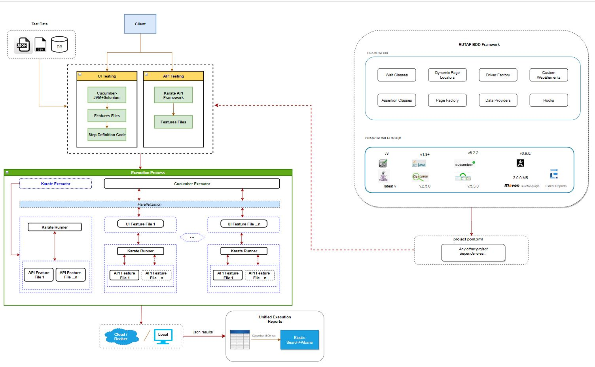

## DEPRECATED 
## RUTAF-BDD User Guide 

#### Introduction 
 - RUTAF-BDD is a Behavior Design Test Automation framework.This framework supports both UI & API testing.
 - The user is expected to write the UI & API test scenarios in feature files in conjunction with Gherkin DSL
 - For API testing, the test scenarios are written in Karate DSL which is a customized Gherkin syntax meant only for API scenarios.


### Prerequistes
 - Java JDK v >=1.8 and <=11.
 - Apache Maven 3.6 and set up the environment variables like M2_HOME, M2. Please refer apache maven site for more info
 - InteliiJ Idea [Community/Ultimate] or Eclipse or any favorite editor of your choice.
 

### Architecture
  ##### RUTAF-BDD 
  
  - RUTAF-BDD uses the following open source libraries:
     - Se-WebDriver, for browser automation framework and supports all standard browsers: Chrome,Firefox and IE.
       Please note that Microsoft is no longer provide support for IE-v11 since Mar'2020.
     - WebDriverManager is being used to download the binaries for all Chrome,Firefox,EdgeChromium,IE and other browsers. The user is not required to download the binaries and maintain for various browser versions.
     - Karate, open source framework is being used for all API testing requirements.
        - **Why we have used Karate?**
           - Karate DSL allows you to write any API (REST,SOAP,GraphQL) scenarios without writing any test code.
           - Karate is bundled with **cucumber v1.2.5** which allows the user to write api tests in gherkin kind of syntax, ofcourse you need to follow a bit Karate DSL.
           - Supports both Java & Javascript [at the moment no support exists of JS ES6, but in Karate v1.0 beta is available].
           - You are also allowed to custom java code and call in feature files
            - Supports multithreading i.e you can run API feature files in parallel mode, sequential or mixed mode [mix of sequential & parallel].
     - Open source BDD framework - Cucumber v6.2.2 is being used for writing feature files.
     - Cucumber+TestNG framework used as test runners, runs the suitrunner.xml when you run via maven command line ```src/test/resources/suiterunner/rutafbddrunner.xml```
     - RUTAF-BDD by default runs all the UI & API tests in parallel mode. You can set the 'runUIAPITestsInParallel' in configuration.properties to false if you want to run all UI &API tests sequentially.
     - Maven is used as build management tool with mvn-sure-fire plugin to run all tests.
     - RUTAF-BDD treats JSON & CSV files as first-class citizens i.e you don't need to write any parser to fetch the data from JSON,CSV files. Please refer these files for more info
         ```
            src/test/java/com/refinitiv/asts/test/playground/JsonParsingEx.java
            src/test/java/com/refinitiv/asts/test/playground/CSVFileParsingTest.java
        ```
     - **RUTAF-TECHSTACK**:
        - Java JDK v1.8+ and <=v11
        - Cucumber v6.2.2 as a BDD framework
        - Se-webDriver v3.141.59 for browser automation framework
        - WinAppDriver for Windows Desktop automation
        - Uses WebDriverManager [io.bonigarcia] to manage the browser binaries        -   
        - TestNG as a testing framework
        - Maven for build management tool
        - Karate framework for API testing
        - Java JDK nashorn engine for executing any Javascript code in API scope.
        - Reports:
            - cucumber-html,cluecucumber,extentreport,extent-pdf-report
        - Integration with {ELK} i.e Elastic search for any future test result analysis.
        - Built in test automation static code analyser with PMD [will be replaced with SonarQube in the near future].The code analyser is buil-in with ASTS framework level custom rules
        - Supports all test data files .json & .csv       


### New Changes in V1.1.1:
 - The RUTAF-BDD jar file is available in BAMS and can be easily download from [here](https://bams-aws.refinitiv.com/artifactory/public.maven.global)  and it is no longer required to install the RUTAF-BDD jar manually via maven.
 - If you're new to BAMS, follow the below steps
    
    - To access the BAMS UI, click [here](https://bams-aws.refinitiv.com/artifactory/webapp/#/home)
    - To generate a API key click [here](https://confluence.refinitiv.com/display/GRAPHQL/How+to+Generate+BAMS+API+Key)
   
   please note that you need to be on the **VPN** to access the above links.
   
 - Add the following the maven repositories in your pom.xml right after the properties tag.
 - **Repositories**:  
    ```
   <repositories>
   <repository>
   <id>bams-public.maven.global</id>
   <url>https://bams-aws.refinitiv.com/artifactory/public.maven.global</url>
   <snapshots>
   <enabled>true</enabled>
   </snapshots>
   </repository>
   <repository>
   <id>a203973.bams.maven.local</id>
   <url>https://bams-aws.refinitiv.com/artifactory/a203973.bams.maven.local</url>
   </repository>
   </repositories>
    ```

 - Open settings.xml file under .m2 folder of user directory, add the following content. If you dont have settings.xml under .m2 folder, you can create and add the below content
 - If you have already settings.xml file just add the below server tags to the file
   (OR) you can copy the below and create a new settings.xml in order to download artifacts from BAMS
    ```
       <?xml version="1.0" encoding="UTF-8"?>
        <settings xsi:schemaLocation="http://maven.apache.org/SETTINGS/1.1.0 http://maven.apache.org/xsd/settings-1.1.0.xsd" xmlns="http://maven.apache.org/SETTINGS/1.1.0" xmlns:xsi="http://www.w3.org/2001/XMLSchema-instance">
            <servers>
                <server>
                    <id>bams-aws-default-maven-global</id>
                    <username>s.asts.bams</username>
                    <password>AKCp8ihL8T5CgbKW2UqFRu4Dv4vVKRxrgUVdVnjxhqpbMZvinN44WoiRGmjxDLtWBguh9mauG</password>
                </server>
                <server>
                    <id>bams-public.maven.global</id>
                    <username>s.asts.bams</username>
                    <password>AKCp8ihL8T5CgbKW2UqFRu4Dv4vVKRxrgUVdVnjxhqpbMZvinN44WoiRGmjxDLtWBguh9mauG</password>
                </server>
                <server>
                    <id>a203973.bams.maven.local</id>
                    <username>s.asts.bams</username>
                    <password>AKCp8ihL8T5CgbKW2UqFRu4Dv4vVKRxrgUVdVnjxhqpbMZvinN44WoiRGmjxDLtWBguh9mauG</password>
                </server>
            </servers>
        </settings>


    ```
 - When you run your tests on Concourse pipeline you can call settings.xml via maven command, ```mvn clean verify -s settings.xml```. It is advised to get a generic service/test accounts on TEN DOMAIN,to access BAMS instead of sharing your own user credentials.
   We are in the process of getting a new service accounts but we recommend you to create account for your project needs. 
 - Added a new **CliUtils** class under [com.refinitiv.framework.utils], which allows the user to run any cli commands. This also few **AWS** connect methods: ```connectToAWS,openAWSBastionSSHTunnel```, this method expects that you have already configured the AWS Cmdlets via PWSH [Powershell v7.1.0]. 
   If not, click [here](https://git.sami.int.thomsonreuters.com/cloud-solutions-architecture/pcp-cloud-connect-documentation) and follow the onscreen instructions.
  
    
- Added a new **RandomData** class under [com.refinitiv.dataProviders.RandomData] which generates fake data like first name, lastname, address, sample creditcards for all type VISA,AMEX, DISCOVER etc.,
 - Added a new **JSONUtils** class under[com.refinitiv.framework.utils] class to parse or read a json file. There are 2 methods available in this utils class viz, 
 
   ```getJSONContent(String jsonFile, String jsonPath)``` returns **com.fasterxml.jackson.databind.JsonNode** which allows you to iterate the jsonnodes and fetch the data.
     - Method Args: ```jsonFile``` specify the json file absolute path location.
       
     - Method Args: ```jsonPath``` refer to jayway JSON path syntax, click [here](https://github.com/json-path/JsonPath#path-examples) to know more about this syntax.
   
   Example:
     ```For Ex, if JSON Content is :
      { "firstName": "John", "lastName" : "doe", "age" : 26,  "address"  : { "streetAddress": "naist street", "city" : "Nara"},
      "phoneNumbers": [
          {"type"  : "iPhone","number": "0123-4567-8888"},
          {"type"  : "home","number": "0123-4567-8910" }
        ]
      }
      To Fetch  age or firstName the JSONPath should be give as "$.firstName", "$.age" for age
     To get all types inside phoneNumbers array: $.phoneNumbers[*].type```

 ```getJSONDocument(String jsonFile)``` returns **com.fasterxml.jackson.databind.JsonNode** which also retunrs the JsonNodes but it reads the json file using fasterxml Jackson processor


#### Supported Browsers
 - RUTAF-BDD supports browsers - Chrome,Firefox,IE [in-progress] & EdgeChromium[in-progress]

### How to Configure?
 - Download the RUTAF-BDDTEST project or clone it.
 - Import the downloaded project as a maven project or launch it via intellIj editor, the editor will configure it as a maven.
 - Assume that you have intelliJ editor, click on the Maven on the right side of the editor and run the goal: **compile**
 - Once the compilation is successful, you can start using the framework to write features or test scripts.
 - Go to the pom.xml, uncomment the dependency '```<groupId>com.refinitiv.asts</groupId>```'
 - Build the project via IntelliJ or Eclipse editor.

#### How to check if the framework setup & configuration is done correctly?
 - Run this feature file from IDE : ```src/test/resources/features/ui/UIAndAPI.feature```, open this feature file, and right click on anywhere in the file and click on Run on IDE menu
 - If this feature executes correctly, Congratulations! you're good to use.


#### Test Data Providers:
- The framework supports JSON & CSV files right out of the box i.e the user is not required to add any additional parsers to parse & read the data.
- However, you can also add other file types like excel or .yml/yaml types and implement the support for the files you require.
- Refer this example, how to process/parse a CSV file [here](src/test/java/com/refinitiv/asts/test/playground/DataFilesTest.java)
- Refer this example, how to process/parse a JSON file [here](src/test/java/com/refinitiv/asts/test/playground/JsonParsingEx.java)
- Test data can be defined in a number of different ways using the RUTAF-BDD framework.
- The two main areas where test data can be added, and why and what type of data can/should be added to these areas.
  You may want to follow different development practices while creating your automated tests. This may include following a Data Driven approach. In order to achieve the most efficient way of following this practice.
  We have allowed users to create data files to use for their tests in the form of JSON/CSV files.
  JSON files are flexible and can also be retrieved as array lists if needed. Therefore containing more of the same type of data in a single file.
  An example of a JSON file can be seen below:
  ```
      {
     "data": {
       "logininfo": [
         {
           "USER1": "trader2@fxtesting",
           "PASS1": "fxall123",
           "PROVIDER1": "BANK1"
         }
       ],
       "orderinfo": [
         {
           "CUST_ORDER_ID": "$",
           "CUST_ALLOC_ID": "$",
           "CCY_PAIR": "EUR.USD",
           "VALUE_DATE": "SPOT",
           "ACCOUNT": "acct1",
           "SIDE": "S",
           "DEALT": "EUR",
           "AMOUNT": "100000",
           "PROVIDERS": "PROVIDER1",
           "REG_VENUE": "SPOT"
         }
       ]
     }
   }
  ```

- The above test data files should be added within the following folder:
  ```src/test/resources/testData/```
  If needed you can create sub folders to organise your JSON data files as well.

- Another way of passing data into your tests can be via the Feature Files like providing test data sets in Examples/DataTables section of Scenairo/Scenario Outline.
  However it is worth noting that by doing this, it WILL increase your maintenance effort. As an example if you have added data as a Scenario Outline Example table
  and the same data is used for multiple Scenarios, then you will be required to maintain it for all the Scenario(s). By using a JSON file, you can centralise your efforts and maintain a single file.

- Following on from the Test Data section. This area will determine how you make reference to your JSON data files,
  so that you can then use them within your test automation code. User the following folder:
  ```src/test/java/dataProviders```
- You will create a reference to your JSON file. Here you will have the method that is actually pulling in the data from the whole file.
  You can marshall/un-marshall the data to a POJO from .json file using fastermxljackson/Gson json parsing libraries.

NOTE: As a rule of thumb, if you have multiple sections within your JSON file, it is advised to create a separate DataProvider class for each section. Please refer these
dataproviders class files [testdatajsonproviders](src/test/java/com/refinitiv/asts/test/dataproviders)


#### Desktop Support
 - RUTAF-BDD now supports Windows desktop applications. There are few prequistes to follow
 - To use the WinAppDriver, there are 2 ways 1) via standable WinAppDriver installation 2) via AppiumServiceBuilder
 - RUTAF-BDD framework is using appium service,as the AppiumServiceBuilder allows you to control WinAppDriver programmtically.
 - To install the Appium node package run the following command:
     - You must install Node, at the time of writing this document, node-v14.15 is the current LTS, click [here](https://nodejs.org/en/download/).
     - After the installation of node, run the following command 
      ```npm install -g appium```  This will install appium globally and also sets the any environment variables (if required)
 - Appium uses WinAppDriver under the hood.
 

 <del>Install WindowsAppDriver, click [here](https://github.com/Microsoft/WinAppDriver/releases) to download.
 Ensure that you have the developer mode turned on. This may be required for older version of OS versions <1500. But please double check on WinAppDriver page.</del>

 - To acquire to a WinAppDriver instance, you need to do the following:
   
   ```
       CreateDriver.getInstance().startWinAppDriver();
       final WindowsDriver<?> winDriver = CreateDriver.getInstance().getWinDriver();   
   ```
   Please note that, above WinAppDriver start with 'Root' level capabilities
 - To start the WinAppDriver with app capabilities. Go to the configuration properties, and provide 
   ```
    For Ex: Syntax is : app;"C:\\Program Files (x86)\\Thomson Reuters\\Eikon\\Eikon.exe",key2;<value2>
    windowsAppCapabilities=app;C:\Program Files (x86)\Thomson Reuters\Eikon\Eikon.exe
     
    # or you can attach with AppId of your application like this. Ensure that the name of the application is accurate.
    windowsAppCapabilities=app;attach@Refinitiv Eikon
   ```
 - You don't worry about how to get the appId of your application, the framework can learn that with name of the application.
   If you want to know what is the AppId of application, do the following:
    - Run ```shell:Appsfolder```
    - Press Alt+V, select Details and choose details and select -AppUserModelId
 - How to attach to an existing window or application which is on Desktop?
   Here For ex: the framework is trying to attach to a EikonLoginWindow.
   ```
     final WindowsDriver<?> eikonLoginWindow = CreateDriver.getInstance().attachToExistingAppWindow("EikonSplashScreen", "classname");
   ```
   
  - **IMPORTANT NOTE**:
    - If the WinAppDriver is running with 'Root' capabilities, the performance of the tests may slow down, if you have other unrelated windows opened i.e any non AUT[application under test] windows.
      WinAppDriver scans through all the opened windows to look for the desired window/element, more the no. of windows you have on the screen, the slower test execution. Please note that this is the inherent nature of WinAppDriver tool.
    - RUTAF-BDD also has an ability to attach an existing window as mentioned above but you may need to switch to the windows explicitly in your test code if any other extra windows/tool bars opens up after you perform an action on the current window.
      Hence, we recommend to use WinAppDriver 'Root' capabilities for this type of scenario. However you can reach out to ASTSTeam if you have any issues. 

#### How to write a Desktop Test Feature file?
   - Refer this feature file ```src/test/resources/features/ui/WindowEikonLogin.feature```
   - To run this feature file, you need to change the tags to '@desktop' or '@chromiumdesktop' in UITestRunner and run ```mvn clean verify```
   
  
#### Electron or ChromiumDesktop App support
  - RUTAF-BDD supports Chromium desktops or Electron apps, the user needs to provide the localDebuggerAddress.
  - The framework attempts to attach to an existing chrome window opened within your Desktop App.
  - To configure, go to configuration.properties
     - Change the default properties like this:
    ```
        # Local debugger port addres to attach the chromedriver to Electron app
        localDebuggerAddress=localhost:8088
        # ChromeDriver version for electron desktop app. if it works on latest chrome version just provide "current"
        # values should 79/80/current [current is for latest chrome driver]
        chromeVersionForElectron=79

    ```         
#### Framework Hooks
  - RUTAF-BDD supports all cucumber hooks after & before Scenario and after/beforeSteps. Check out basestepdef ```src/test/java/com/refinitiv/asts/test/stepDefinitions/BaseStepDef.java```
  - The framework also support testNG hooks but the priority goes to cucumber first followed by testng 
  - Refer the below section for custom api level hooks

  
#### Custom API Hooks & APIThreadCount
  - Added few custom API Execution Hooks you can add your own custom afterScenario, afterStep, afteFeature methods to send the results to Test Rails or JIRA
    during the process of execution. Earlier, you were allowed to send the results only at the end of complete execution.
  - Look for the APIExecution hook here ```src/test/java/com/refinitiv/asts/test/runners/APIExecutionHook.java```
  - If you want to run all API tests sequentially, change apiThreadCount in configuration.properties to 1
  - If you want to run few API scenarios in sequentially and few in parallel mode, do the following:
     - Add feature level tag as ```@parallel=false``` in API feature file 
    Please note that this mixed mode of running the feature files is available with in API world. Please submit a request to the ASTSTeam if you want to run UI tests in a mixed mode.
  
#### Se-Grid Support
  - RUTAF BDD supports traditional Se-Grid, and distributes the tests across various nodes via Hub-Node json configration.
  - Take a look at the default JSON configuration given for Hub & Nodes here 
    ```
        src/test/resources/properties/hubConfig.json
        src/test/resources/properties/nodeConfig.json
    ``` 
#### UI Test Scenario
  - To write a UI test scenario, you need to have a pageobject, pageclass and a locators in a json file.
  - For Ex, to write a Login test, you need to do the following:
      - Capture the object locators required for the login page and store them a file ending with .json under locators directory.
      - Please refer the sample .json files to follow the format. ```src/test/resources/locators/login/login.json```
      - Write a LoginPageObject class, to extract the locator information. The LoginPageObject should contain the any fields of WebElement type.
        Refer this example : ```src/test/java/com/refinitiv/asts/test/pageObjects/LoginGenericPO.java```
      - As the framework follows the Page object design pattern, all the actions & behavior of the page should be defined under LoginPage under pageActions directory.
         Refer this example: ```src/test/java/com/refinitiv/asts/test/pageActions/LoginGenericPage.java```
      - You can either write a new feature file or use existing feature file to write the scenario.
      - Finally, add the step definition code for the feature file. Please note that the step defintion code should be under stepDefintions directory.
      - All the UI tests should be tagged with @ui , just to distinguish the type of test during execution.
  
#### API Test Scenario With Karate
   - Writing an API scenario with Karate,is quite simple. Firstly you need to get familiar with custom Karate Gherkin DSL. This may be a bit consuming for the few days but later it will be quite easy.
   - For Ex: to make a HTTP GET request, the user is required to write only feature file no stepdefinition code is required.
      Refer this API feature file : ```src/test/resources/features/api/demo/DummyReqRes.feature```
   - Also refer the Karate documentation [here](https://github.com/intuit/karate#-karate)
   - Refer the some of the examples hosted [here](https://github-risk.int.thomsonreuters.com/sai-santhosh/karate-apitesting)

#### Externalize Object Locators
   - Object locators are requried only for UI tests and the locators should be externalized.
   - Capture the object locators you requrie for the page you are supposed to interact and store them in a .json file.
   - THere is **one important file to follow when you refer the objects** in pageObject classes.
      - For Ex: in a login.json file, if the locator is given as 'signOut',you need to ensure that the field name of WebElement should be same as the locator name. It is case-insensitive.
   - It is recommended to use Button type for any button locators, TextInput for any text input type of locators.
     Refer this LoginGenericPage.java file
 
#### Dynamic Locator Changes
   - For any UI test, the framework allows you to modify the object locators dynamically.
   - The traditional pageobject factory pattern will not allow you to provide any dynamic locators with @FindBy, but the RUTAF-BDD allows you to alter the locators on the fly.
   - 

#### Framework Static Code Analyser
   - 
#### How to Run?
 - UITestRunner has an ability to run all the UI features and make sure that all the features are tagged with @ui.
 - You can either run the UITestRunner like a testng test from your favorite IDE like IntelliJ or Eclipse
 - If you want to run both both API & UI tests together, it is good to use maven command like this
    
    - '*verify*' goal of Maven would run both API & UI test together in parallel mode. It is ideal to use thread count upto 
    3, just to avoid unpredictable results. Please contact ASTS team if you have any issues here.
 - To run both API & UI features via maven, run this command in terminal:
   ```mvn clean verify ```
    
 - To run only the APITests via Karate, just run the  com/refinitiv/asts/test/runners/APITestRunner.java as Testng test
   or ```mvn clean test -Dtest=APITestRunner.java``` via maven

 - To run all the API test features but not UI tests via maven run this command:
    ```
      mvn clean -Dtest=APITestRunner verify // Runs all API features available under  'api' folder
      
    ```
   Similarly you can run all UI features files without API via this maven command:
   ```
      mvn clean -Dtest=UITestRunner verify
   ```
 
#### How to Run a API scenario from the IDE?
  - Go to the ```src/test/resources/featurestemplate/api/ApiScenario.feature``` and add the API feature file which you would like run at line ```10```
  - Ensure that you place api feature file which you want to execute under path : ```src/test/resources/features/api```  
     in this apisceario.feature file, I have added 'worldcheckonline.feature' i.e this feature will be executed when you want to run the ApiScenario.feature file via IDE.
      - **Why we need to follow this approach?**
         -  As Karate api framework bundles with cucumber v1.2.5 and runner class lives in ```cucumer.api.cli.Main``` class whereas the RUTAF-BDD project uses the latest cucumber bdd framework v6.2.2, the runner class is in ```io.cucumber.api.*``` and to
    bridge this gap need to follow the process described above. Please note that this is only required if you would like to run via IDE. When we execute the entire test pack, all the api & UI feature files will run via maven single command line.
            
#### Test Execution Reports:
  - RUTAF-BDD offers 3 types of HTML reports : **cucumber-html, cluecucumber,extent-reports, extent-report-pdf**
  - Execution Reports Types:    
    - Both Cucumber-HTML & Cluecucumber report will be generated only when you run the runners via maven verify phase ```mvn clean verify```
    - Extent-Reports [both HTML & PDF formats] will be generated when you run this UITestRunner ```src/test/java/com/refinitiv/asts/test/runners/UITestRunner.java```
      The extent-reports will be also generated when you run via maven command, but only for UITests. However, if you want to have extent reports for UITests, please submit a request to us. 
      

#### How to Add a new feature file?
  - Follow a sample feature file given under features/ui folder, look at the internetUI.feature 
  - Follow the SampleTestStepDef.java class file how to write step defns
  - Follow the DataTablePO.java, how to add the pageObjects to a class file. Note that DataTablePO is a sample page object class file
    We request you to create a similar PO class file for your needs
  - The page objects locators should be stored in a .json file under src/test/resources/locators folder. Refer the datatable.json file
  - PageActions folder should contain all the page actions you perform on the page. For ex to login to a portal, write a method loginToPortal under SomePage.java file under pageActions
    Refer this file  DataTablePage.java    
      ```mvn clean verify```
      
      
#### Framework as ADK
  - To provide the framework as a standalone ADK
  - Provide separation of framework and WC1 code in a clean way
  - Seamless integration via the pom.xml being called in as a dependency:
    ```
    <dependency>
      <groupId>com.refinitiv.asts</groupId>
      <artifactId>RUTAF-BDD</artifactId>
      <version>1.0</version>
    </dependency>
    ```
  - All the heavy lifting of dependencies done by the project are now taken care by the RUTAF-BDD jar
  - Easily consumed by the project:
    ```
    public class TestJar {
      public static void main (String[] args) throws Exception {
        System.setProperty("browserName", "chrome");
        ConfigureDriver configureDriver = new ConfigureDriver();
        configureDriver.setUpDriver();
        WebDriver driver = CreateDriver.getInstance().getDriver();
        driver.get("http://www.google.com");
      }    
    }
    ```


### Index [The below documentation is not complete]
- Some of the documentation items below are not linked or either in progress.
<html>
  <table id="readme">
  <tr>
      <td>Framework</td>
      <td><a href="#rutaf-bdd">RUTAF-BDD Framework Components</a></td>
      <td>InProgress</td>
  </tr>
  <tr>
        <td>Driver Support</td>
        <td><a href="#supported-browsers">Browser Details</a></td>
        <td>InProgress</td>
    </tr>
     <tr>
            <td>Test Data Supported File Types</td>
            <td><a href="#test-data-providers">Test Data</a></td>
            <td>InProgress</td>
      </tr>
   <tr>
            <td>Windows Apps Support</td>
            <td><a href="#desktop-support">Desktop Support</a></td>

      </tr>
   <tr>
     <td>UI Feature File</td>     
     <td><a href="#how-to-add-a-new-feature-file">UI Test Scenario</a></td>
   </tr>
   <tr>
        <td>API Feature File</td>
        <td><a href="#api-test-scenario-with-karate">API Test Scenario With Karate</a></td>
      </tr>
   <tr>
          <td>Object Locators</td>
          <td><a href="#externalize-object-locators">Externalize Object Locators</a></td>
        </tr>
   <tr>
       <td>Dynamic Page Locator Changes</td>
       <td><a href="#dynamic-locator-changes">How to Apply Dynamic Locator Changes</a></td>
     </tr>
    <tr>
          <td>Static Code Analyzer</td>
          <td><a href="#index">About Static Code Analyser</a></td>
        </tr>
      <tr>
              <td>Framework Global Constants</td>
              <td><a href="#index">Global Constants</a></td>
            </tr>
 <tr>
      <td>Hooks</td>
      <td><a href="#index">Framework Hooks</a></td>
 </tr>        
  <tr>
       <td>Database Support</td>
       <td><a href="#index">DB Template</a></td>
  </tr>        
   <tr>
        <td>Framework WebElements</td>
        <td><a href="#index">Custom Web Element</a></td>
   </tr>    
    <tr>
           <td>Generic Utils</td>
           <td><a href="#index">Common Utilities</a></td>
      </tr>  
    <tr>
            <td>Wait Utils</td>
            <td><a href="#index">Wait Utilities</a></td>
       </tr> 
          <tr>
                <td>How to create Fake Test Data</td>
               <td><a href="#index">JSON Faker Data</a></td>
            </tr> 
          <tr>
                  <td>Sharing State between Steps</td>
                 <td><a href="#index">Scenario Context & Sharing</a></td>
              </tr> 
<tr>
     <td>Test Package</td>
    <td><a href="#index">Organize Test Package</a></td>
 </tr> 
<tr>
     <td>Karate Config</td>
    <td><a href="#index">About Karat.Config.JS file</a></td>
 </tr> 
 <tr>
      <td>Page Objects</td>
     <td><a href="#index">How to write Page Object Class</a></td>
  </tr> 
  <tr>
       <td>Page Actions</td>
      <td><a href="#index">How to write Page Action Class</a></td>
   </tr> 
  <tr>
       <td>Test Runners</td>
      <td><a href="#index">About UI & API Test Runners</a></td>
   </tr> 
    <tr>
         <td>Test Step Definitions Code</td>
        <td><a href="#index">How to write Test Step Definition Code</a></td>
     </tr> 
    <tr>
          <td>Test API Constants</td>
         <td><a href="#index">What should go into API Test Constants</a></td>
      </tr> 
       <tr>
             <td>Test Data Providers</td>
            <td><a href="#index">What should go into Test Data Providers</a></td>
         </tr> 
         <tr>
               <td>Where to Store Feature Files</td>
              <td><a href="#index">Centralize UI & API Feature files & dependencies</a></td>
           </tr> 
     <tr>
                <td>About Configuration Properties</td>
               <td><a href="#index">Config Properties In Test</a></td>
            </tr> 
   <tr>
                 <td>About Test Data</td>
                <td><a href="#index">Test Data for Scenarios</a></td>
             </tr> 
     <tr>
                   <td>Code Documentations</td>
                  <td><a href="#index">Framework Code Java Docs</a></td>
               </tr> 
      <tr>
                    <td>Framework as ADK</td>
                   <td><a href="#index">How to use RUTAF BDD fat jar as ADK</a></td>
                </tr> 
 </table>
</html>    
#### Code Documentations
Below you will find the location of the JavaDocs for the RUTAF-BDD test automation framework.
Please navigate here from the parent directory:
_/docs/javaDocs_


If you require any more information please do not hesitate to get in contact with us:

Sai Santhosh - 
_Snr Test Architect_
sai.santhosh@refinitiv.com

**OR**

Usman Hussain - 
_Snr Test Architect_
u.hussain@refinitiv.com


**Accelerated Shared Testing Services** (ASTS)